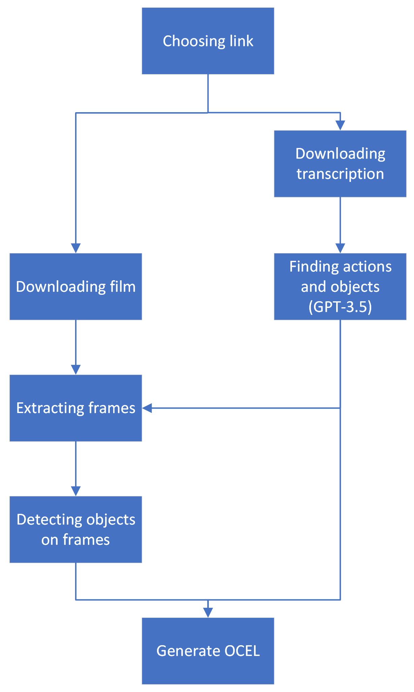

# Creating object-centric event logs from instructional/tutorial/how to videos

## Table of Contents

- [Project Description](#project-description)
- [Overview](#overview)
- [Installation](#installation)
- [Usage](#usage)
- [Example Results](#example-results)
- [Files description - Step by step](#files-description---Step-by-step)
- [Features](#features)

## Project Description

The aim of this project is to develop a system that can automatically generate object-centric event logs from instructional, tutorial, or how-to videos. In today's digital age, there is an abundance of video content available online, providing step-by-step instructions for various tasks and activities. However, it can be challenging to extract structured data from these videos to create event logs that capture the sequence of actions performed on specific objects.

By leveraging computer vision techniques and natural language processing, this project aims to bridge the gap between unstructured video content and structured event logs. The system will analyze the video frames to detect and track objects of interest, such as tools, equipment, or items being manipulated by the instructor in the video. It will also process the accompanying transcriptions to extract relevant textual instructions or annotations.

The extracted information will be used to construct object-centric event logs, which will capture the temporal order of actions performed on each object. These event logs can be invaluable for various applications, including process automation, knowledge extraction, or interactive tutorials.

## Overview

Below is a simplified diagram of how our project works.

<div align="center">
  
</div>

As you can see above, the link to the video on youtube is selected first. Then the transcript is downloaded with timestamps, which are fed to gpt-3.5, which combines fragments of the transcript and returns new timestamps (several timestamps may have been combined) and detected objects and actions. In the next step, the entire film is downloaded, from which the appropriate frames are selected, using previously corrected timestamps. Objects are detected on each frame. Based on all the information collected in this way, an object-centric event log is created.

## Installation

To successfully run the code, ensure that you have installed all the libraries listed in the `requirements.txt` file. You can do this by running the following command:

```bash
pip install -r requirements.txt
```

The next step is to download the *yolos-tiny* model to the `models` folder, this can be done with the following command:

```bash
git lfs clone https://huggingface.co/hustvl/yolos-tiny
```

To make use of GPT-3.5, follow these steps:

1. Open the `processing.py` file in your project.
2. Locate line 13 and find the code snippet `openai.api_key = ""`.
3. Replace the empty string `""` with your own API key within the quotation marks.

## Usage

To generate an OCEL (Object-centric event logs), follow these steps:

1. Create a `Processing` class object and provide a link to a YouTube video as an argument.
2. Call the `.generate_OCEL()` method on the processing class object.
   - Optionally, specify the name of the file where the eventlog is to be saved.
3. The generated event log can be found in the `logs/events` folder.
4. The generated objects can be found in the `logs/objects` folder.

Example (from `processing.py`):
```python
if __name__ == "__main__":
    obj = Processing('https://www.youtube.com/watch?v=Y5UqE_hpuSw')
    obj.generate_OCEL('ocel_example.csv')
```
It is important that the link does not contain 'shorts'. 

## Example Results

Sample ocel files are provided in 'logs' folder.

Youtube videos for testing purposes:
   - https://www.youtube.com/watch?v=WC_upRGlvMs&ab_channel=Mashable
   - https://www.youtube.com/watch?v=iNBTSDryewM
   - https://www.youtube.com/watch?v=Y5UqE_hpuSw&ab_channel=NickDiGiovanni

Example for [https://www.youtube.com/watch?v=Y5UqE_hpuSw](https://www.youtube.com/watch?v=Y5UqE_hpuSw).

| ocel:eid | ocel:activity | ocel:timestamp | duration | ocel:type:items_text | ocel:type:items_image |
|----------|----------|----------|----------|----------|----------|
| 0  | Making soup dumplings    | 0.08     | 8.00   | ['ingredients']   | ['person', 'dining table', 'cup']   |
| 1  | Adding foie gras         | 8.08  | 3.84 | ['two tablespoons foie gras']  | ['person', 'cup']  |
| 2  | Boiling Stock            | 11.92  | 6.56 | ['chicken stock']  | ['person', 'cup'] |
| 3  | Cooling  | 18.48         | 1.68  | ['gelatin mixture']  | ['person', 'cup'] |
| 4  | Preparing filling        | 20.16  | 13.04  | ['one minced green onion', 'one tablespoon of rice wine', 'one and a half teaspoon of sesame oil', 'teaspoon of soy sauce', 'one and a half teaspoons of sugar', 'about a half a pound of ground pork', 'a little salt and a little pepper', 'gelatin mixture']  | ['person', 'bowl']  |
| 5  | Building dumplings       | 33.20  | 10.80  | ['filling']  |   |
| 6  | Steaming dumplings       | 44.00  | 2.24  | ['bamboo steamer', 'aluminum foil ball plate', 'dumplings']  | ['person']  |
| 7  | Making sauce             | 46.24  | 8.32 | ['balsamic vinegar', 'soy sauce', 'julienned ginger']  | ['person'] |
| 8  | Eating                   | 54.56  | 0.00  | ['soup dumplings']  | ['person', 'spoon', 'bowl']  |

## Files description - Step by step
### 1. processing.py

 Main file which we execute. The necessary libraries and modules are imported, including custom modules like events, download_video_ydl, youtube_transcript_api,     extracting_gpt, and detect_objects.
 - Class Definition - Processing: The main class is defined, which represents the processing of a YouTube video. It contains methods for downloading transcripts, 
   processing with GPT (Generative Pre-trained Transformer), object recognition, summarization, generating durations, and creating an OCEL file.
 - Initialization: The Processing class is initialized with a YouTube video URL. It sets up various instance variables and creates an empty EventLog object.
 - Downloading Transcripts: The download_transcripts method is called to download the video's transcripts using the YouTubeTranscriptApi library.
 - GPT Processing: The gpt_processing method is called, which utilizes the OpenAI GPT-3.5 model to process the transcripts and generate objects, actions, and start times 
   for each step.
 - Object Recognition: The object_recognition method is called to download the YouTube video and extract frames at the specified timestamps. It then uses an object 
   detection model to identify objects in the extracted frames.
 - Summary Generation (Commented Out): There is a commented-out section for generating summaries of the video using the bart-large-cnn model. It is currently disabled in 
   the code.
 - Duration Calculation: The generate_durations method calculates the durations between each timestamp to determine the time duration for each step.
 - Generating OCEL: The generate_OCEL method is called to generate an `.csv`. It combines the processed data from GPT, object recognition, durations, and other         
   information to create Event objects. These objects are added to the EventLog object, which is then saved as a `.csv` file.
 - Helper Function - extract_youtube_id: This function extracts the YouTube video ID from a given URL using regular expressions.
 - Main Execution: An instance of the Processing class is created, and the generate_OCEL method is called with a YouTube video URL. The resulting `.csv` is saved as `ocel_{*name*}.csv`.
   
### 2. events.py

 This code defines two classes: Event and EventLog, and provides methods for creating an OCEL (Object-Action-Start-End Log) file from an EventLog object.
 - Event Class:
   - The Event class represents an event in the log and has attributes such as event_id, timestamp, activity, duration, summary, items_text, and items_image.
   - It provides an initializer method to set the attribute values.
 - EventLog Class:
   - The EventLog class represents a collection of events.
   - It maintains a list of Event objects in the events attribute.
   - The class provides methods to add and remove events from the log, retrieve all events, create a pandas DataFrame from the log data, and convert the log to an OCEL 
    format.
   - add_event(event: Event): Adds an event to the log by appending it to the events list.
   - remove_event(event_id): Removes an event from the log based on its event_id.
   - get_events(): Returns the list of events in the log.
   - create_dataframe(): Creates a pandas DataFrame from the events data, where each column corresponds to an attribute of an event.
   - create_ocel(): Converts the log to the OCEL format using the pm4py.convert.convert_log_to_ocel function. The log data is converted to a DataFrame and passed as an          argument along with other OCEL-related parameters.
   - save_OCEL_standard(file_name='ocel_test.csv'): Saves the OCEL log to CSV files (ocel_test.csv and ocel_test_cd.csv).
 - pm4py.convert.convert_log_to_ocel:
   - This is a function provided by the pm4py library.
   - It converts a log (EventLog, EventStream, or DataFrame) to the OCEL format.
   - It takes parameters such as log, activity_column, timestamp_column, object_types, obj_separator, and additional_event_attributes to specify the columns and attributes      in the OCEL log.
 - Main Execution (Commented Out):
   - There is a commented-out section that demonstrates the usage of the Event and EventLog classes.
   - An Event object is created, added to an EventLog object, and converted to OCEL format.
   - The OCEL log is then saved to CSV files.
     
### 3. download_video_ydl.py

 This code defines a class called YouTubeDownloader that provides functionality to download YouTube videos and extract frames from them.
 - YouTubeDownloader Class:
   - The YouTubeDownloader class is responsible for handling the download and frame extraction operations for YouTube videos.
   - It takes parameters such as save_directory, resolution, format, framerate, and audio during initialization.
   - The save_directory specifies the directory where the downloaded video and extracted frames will be saved.
   - The resolution determines the maximum resolution of the video to be downloaded.
   - The format specifies the video format, such as 'mp4'.
   - The framerate (optional) specifies the desired framerate of the video.
   - The audio parameter determines whether to include audio in the downloaded video.
   - It also maintains attributes such as video_title, video_path, and frame_dir_path to store relevant information.
 - download_video(video_url) Method:
   - This method uses the youtube_dl library to download a video from the given video_url.
   - It extracts the video title and replaces spaces with underscores in the video_title attribute.
   - It builds the necessary options and formats for the download using youtube_dl.YoutubeDL and then initiates the download.
 - _build_format_string() Method:
   - This method constructs the format string for the video download based on the specified attributes during initialization.
   - It considers the desired resolution, video format, and optionally the framerate and audio settings.
   - The format string is built accordingly and returned.
 - _build_output_template() Method:
   - This method constructs the output template for saving the downloaded video.
   - It ensures that the save directory exists and sets the video_path attribute accordingly.
   - The constructed template is returned.
 - extract_frames(path_out, frame_list) Method:
   - This method extracts frames from the downloaded video.
   - It takes the output path for saving the frames and a list of frame numbers to extract.
   - It creates the output directory if it doesn't exist and sets the frame_dir_path attribute.
   - It uses OpenCV (cv2) to read the video frames and save the specified frames as individual images.
   - The frame numbers are rounded and used to seek to the corresponding positions in the video.
   - The extracted frames are saved with filenames in the format video_title_frameXXX.jpg.
 - Main Execution:
   - The code demonstrates an example usage of the YouTubeDownloader class.
   - An instance of YouTubeDownloader is created with a specified save directory, resolution, format, framerate, and audio settings.
   - A YouTube video URL is provided, and the download_video method is called to download the video.
   - The extract_frames method is then called with the output path for frames and a list of frame numbers to extract.
   - Finally, the attributes video_path, frame_dir_path, and video_title are printed to showcase the relevant information.

### 4. extracting_gpt.py

 This code snippet performs text extraction and parsing using regular expressions (re) to extract information from a given text.
 - Text Extraction and Parsing:
   - The code begins with a multi-line string text that contains the input text to be processed.
   - The extracting_gpt function takes the input text as a parameter.
 - Regular Expression Patterns:
   - The function defines multiple regular expression patterns to extract specific information from the text.
 - re.findall and re.search:
   - The function uses re.findall and re.search methods to find matches based on the defined patterns.
   - re.findall is used to find all matches for a pattern within the text, and re.search is used to find the first match for a pattern.
 - Extraction of Steps, Objects, Actions, and Start Times:
   - The function extracts steps, objects, actions, and start times from the given text.
   - It starts by finding matches for the pattern Step \d+:.+?(?=n?Step \d+|$). This pattern matches each step in the text.
   - The extracted steps are stored in the steps list.
   - Within each step, the function further extracts objects, actions, and start times using additional patterns.
   - The extracted objects are split by commas and stored in the obj list.
   - The extracted actions are stored in the action list.
   - The extracted start times are rounded to two decimal places and stored in the start list.
 - Returning the Extracted Information:
   - Finally, the obj, action, and start lists are returned as the output of the extracting_gpt function.
 - Commented Out Code:
   - There is commented-out code that demonstrates the usage of the extracting_gpt function with the provided text variable.
   - The extracted objects, actions, and start times are printed to showcase the results.

### 5. detect_objects.py

  This code defines a class called ObjectDetector that performs object detection using a pre-trained YOLO model.
 - ObjectDetector Class:
   - The ObjectDetector class is responsible for detecting objects in frames extracted from a video.
   - It takes parameters such as model_dir, model_type, frames_dir, and video_title during initialization.
   - The model_dir specifies the directory containing the pre-trained YOLO model files.
   - The model_type determines the type of YOLO model, with the default as 'yolos-tiny'.
   - The frames_dir specifies the directory where the frames extracted from the video are stored.
   - The video_title represents the title of the video, without the file extension.
 - initialize_model() Method:
   - This method initializes the object detection model and the image processor.
   - It loads the pre-trained YOLO model using YolosForObjectDetection.from_pretrained.
   - It also initializes the image processor using YolosImageProcessor.from_pretrained.
 - detect_objects() Method:
   - This method performs object detection on the frames extracted from the video.
   - It iterates over the frame files in the frames_dir and checks if the file starts with the video_title.
   - It opens each frame using PIL.Image.open to process it.
   - It prepares the frame as inputs for the model using the image_processor.
   - It passes the inputs to the model and obtains the detection results.
   - The results are post-processed using the image_processor to obtain the detected objects.
   - The detected objects, along with their labels, are appended to the objects_detected list.
   - The objects_detected list is then returned.

## Features

There are three notebooks in the repository: `summarization_examples.ipynb`, `transcripts_examples.ipynb` and `video_examples.ipynb`. You can see how it works and what it returns, e.g. gpt-3.5 or functions downloading transcripts.
## Acknowledgements

Below are some useful links.
1. [https://openai.com/](https://openai.com/)
2. [https://huggingface.co/hustvl/yolos-tiny](https://huggingface.co/hustvl/yolos-tiny)
3. [https://ocel-standard.org/](https://ocel-standard.org/)

## Contact

If you have any questions, please contact us at this email address:

*mspinczyk@student.agh.edu.pl*
